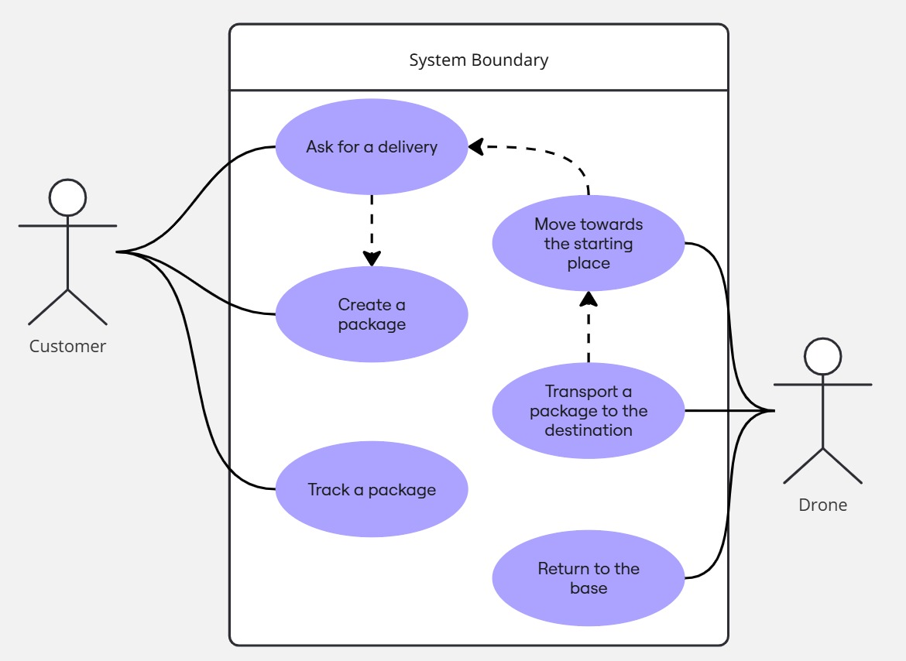
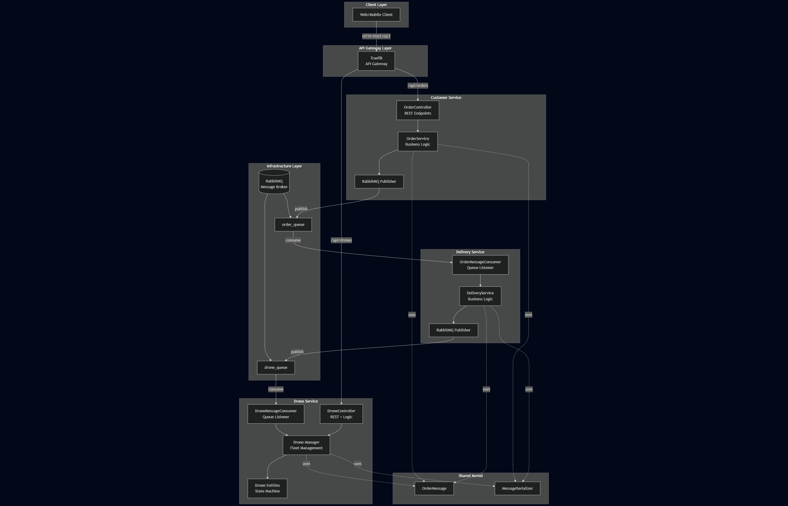

### Use case diagram

### Architecture

The architecture chosen is a microservice architecture, where I choose to design both the drone and customer entities as
microservices, but I decided also to add a "middleman" in order to allow more complex action on the possible orders

### Design

