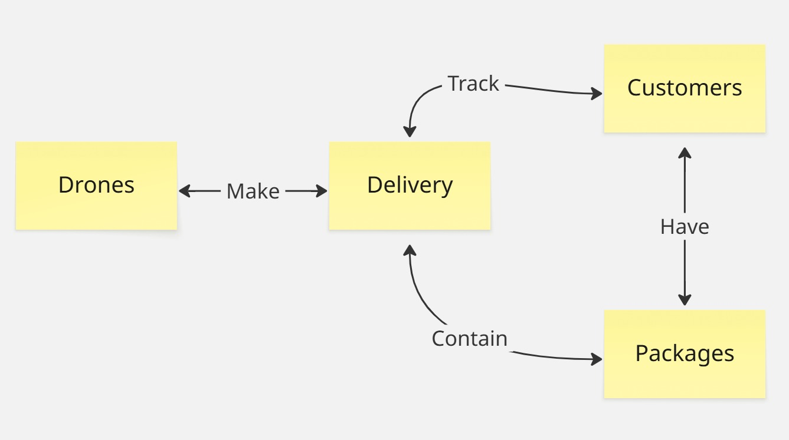

### Domain

### Domain model

### Language
> Customer: A generic user of our system which want to send a `Package` from a place to another 

> Package: Something which a `User` want to move from a place to another, thanks to a `Drone`, which is contained in a 
> `Delivery`

> Drone: An entity designed to move a `Package` from a place to another

> Delivery: An abstract entity which correspond to the `Package` being transported